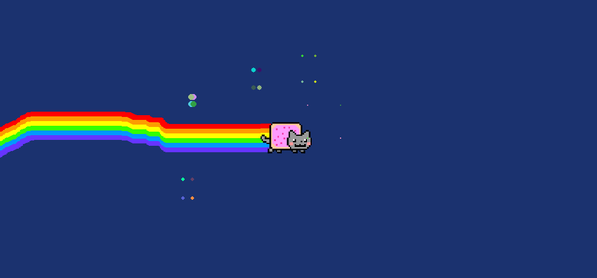

##游戏说明
* 彩虹猫跟随鼠标移动
* 从尾部出现彩虹
* 屏幕颜色随机变化
* particle1 是白色粒子扩散
* particle3 是星星扩散
``` python
# 这个位置可以更改彩虹猫周围星星生成的位置
class NyanStar:
    def add_particles(self):
        star_range = (random.randint(-300, 300), random.randint(-150, 150))
```
##成果展示
